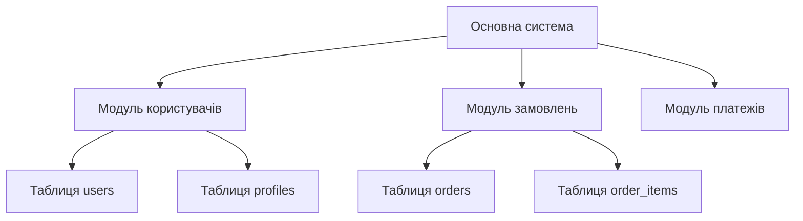
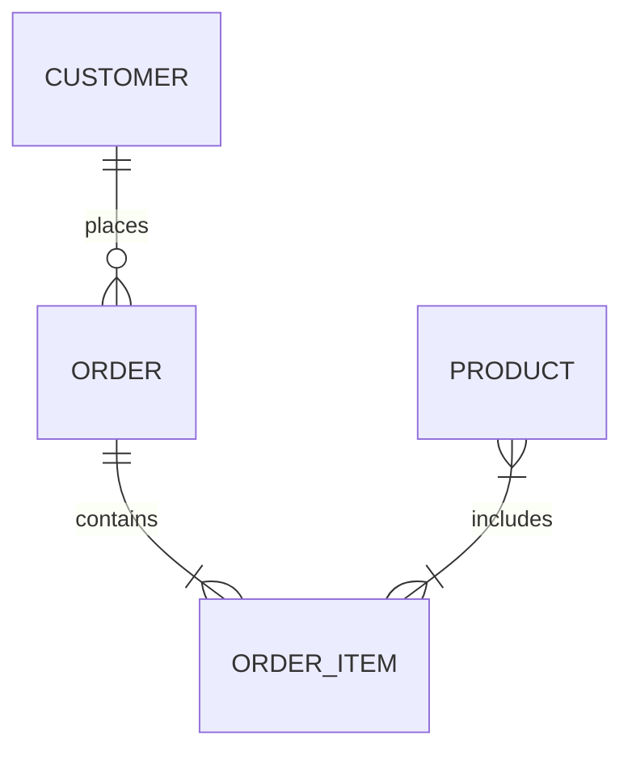
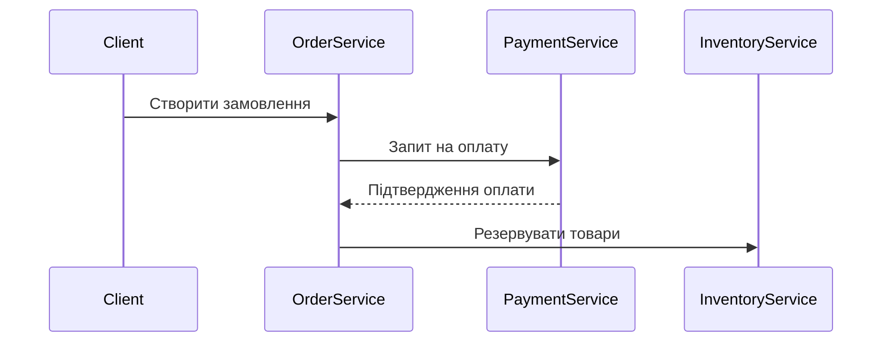

# Документація архітектури бази даних

## Вступ
Цей документ описує архітектурні принципи та шаблони проектування для великомасштабної бази даних, що складається з 20 директорій по 15 таблиць у кожній.

## Архітектурні шаблони

### 1. Шаблони модульності


### 2. Event-Driven архітектура
```python
# Приклад реалізації подій між модулями
class EventBus:
    def __init__(self):
        self.subscribers = {}

    def publish(self, event_type, data):
        for callback in self.subscribers.get(event_type, []):
            callback(data)

# Підписка модуля на події
event_bus.subscribe('order_created', payment_module.process_payment)
```

### 3. CQRS (Command Query Responsibility Segregation)
```sql
-- Приклад розділення на команди та запити
-- Command side
CREATE TABLE order_commands (
    id UUID PRIMARY KEY,
    command_type VARCHAR(50),
    payload JSONB,
    created_at TIMESTAMP
);

-- Query side
CREATE MATERIALIZED VIEW order_summary AS
SELECT user_id, COUNT(*) as order_count 
FROM orders
GROUP BY user_id;
```

## Діаграми взаємодії

### ER-діаграма ключових сутностей


### Sequence діаграма процесу замовлення


## Рекомендації з масштабування

### Горизонтальне масштабування
```sql
-- Приклад шардингу по user_id
CREATE TABLE orders_0 (
    CHECK ( user_id % 4 = 0 )
) INHERITS (orders);

CREATE TABLE orders_1 (
    CHECK ( user_id % 4 = 1 )
) INHERITS (orders);
```

### Кешування
```python
# Приклад використання Redis для кешування
def get_user_orders(user_id):
    cache_key = f"user_orders:{user_id}"
    cached_data = redis.get(cache_key)
    if cached_data:
        return json.loads(cached_data)
    
    # Запит до бази даних
    orders = db.query("SELECT * FROM orders WHERE user_id = %s", user_id)
    redis.setex(cache_key, 3600, json.dumps(orders))
    return orders
```

## Документування процесів

### Шаблон для документування процесу
```markdown
## Процес: Обробка замовлення

### Задіяні модулі
- Модуль замовлень (dir5/)
- Модуль платежів (dir8/)
- Модуль інвентаризації (dir12/)

### Послідовність дій
1. Створення замовлення (таблиця dir5/orders)
2. Перевірка наявності товарів (таблиця dir12/inventory)
3. Оплата (таблиця dir8/payments)
4. Оновлення статусу замовлення

### Обробка помилок
- При відсутності товарів: відміна замовлення
- При помилці оплати: 3 спроби перед відміною
```

## Інструменти для підтримки
1. **SchemaSpy** - для автоматичної генерації ER-діаграм
2. **Liquibase/Flyway** - для керування міграціями
3. **Prometheus + Grafana** - для моніторингу продуктивності

## Висновок
Ця документація забезпечує структурований підхід до проектування складних взаємодій між таблицями в різних директоріях. Для глибшого вивчення рекомендую книгу "Designing Data-Intensive Applications" Martin Kleppmann.

---
*Останнє оновлення: ${new Date().toISOString().split('T')[0]}*