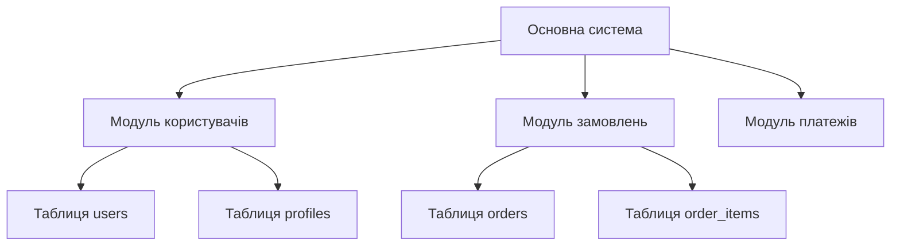
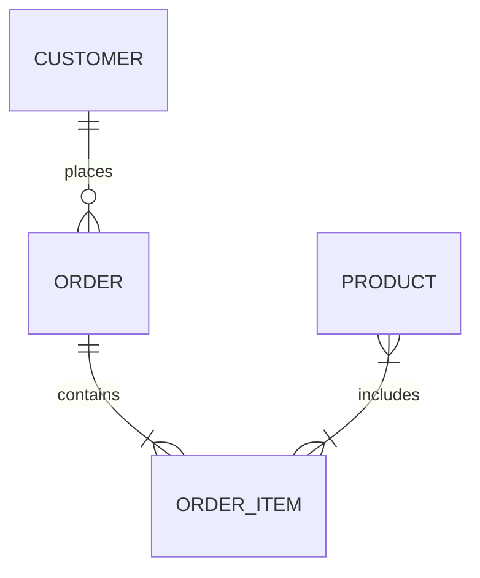
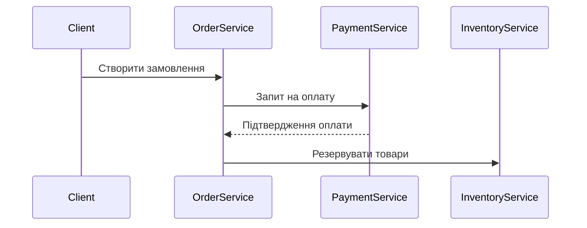

# Документація архітектури бази даних

## Вступ
Документ описує архітектурні принципи та шаблони проектування

## Архітектурні шаблони

### 1. Шаблони модульності


### 2. Event-Driven архітектура
```python
# Приклад реалізації подій між модулями
class EventBus:
    def __init__(self):
        self.subscribers = {}

    def publish(self, event_type, data):
        for callback in self.subscribers.get(event_type, []):
            callback(data)

# Підписка модуля на події
event_bus.subscribe('order_created', payment_module.process_payment)
```

### 3. CQRS (Command Query Responsibility Segregation)
```sql
-- Приклад розділення на команди та запити
-- Command side
CREATE TABLE order_commands (
    id UUID PRIMARY KEY,
    command_type VARCHAR(50),
    payload JSONB,
    created_at TIMESTAMP
);

-- Query side
CREATE MATERIALIZED VIEW order_summary AS
SELECT user_id, COUNT(*) as order_count 
FROM orders
GROUP BY user_id;
```

## Діаграми взаємодії

### ER-діаграма ключових сутностей


### Sequence діаграма процесу замовлення


## Рекомендації з масштабування

### Горизонтальне масштабування
```sql
-- Приклад шардингу по user_id
CREATE TABLE orders_0 (
    CHECK ( user_id % 4 = 0 )
) INHERITS (orders);
CREATE TABLE orders_1 (
    CHECK ( user_id % 4 = 1 )
) INHERITS (orders);
```

### Кешування
```python
# Приклад використання Redis для кешування
def get_user_orders(user_id):
    cache_key = f"user_orders:{user_id}"
    cached_data = redis.get(cache_key)
    if cached_data:
        return json.loads(cached_data)
    
    # Запит до бази даних
    orders = db.query("SELECT * FROM orders WHERE user_id = %s", user_id)
    redis.setex(cache_key, 3600, json.dumps(orders))
    return orders
```
## Документування процесів

### Шаблон для документування процесу
```markdown
## Процес: Обробка замовлення

### Задіяні модулі
- Модуль замовлень (dir5/)
- Модуль платежів (dir8/)
- Модуль інвентаризації (dir12/)

### Послідовність дій
1. Створення замовлення (таблиця dir5/orders)
2. Перевірка наявності товарів (таблиця dir12/inventory)
3. Оплата (таблиця dir8/payments)
4. Оновлення статусу замовлення

### Обробка помилок
- При відсутності товарів: відміна замовлення
- При помилці оплати: 3 спроби перед відміною
```

## Інструменти для підтримки
1. **SchemaSpy** - для автоматичної генерації ER-діаграм
2. **Liquibase/Flyway** - для керування міграціями
3. **Prometheus + Grafana** - для моніторингу продуктивності

## Висновок
Ця документація забезпечує структурований підхід до проектування складних взаємодій між таблицями в різних директоріях.
 Для глибшого вивчення рекомендую книгу "Designing Data-Intensive Applications" Martin Kleppmann.

---
*Останнє оновлення: ${new Date().toISOString().split('T')[0]}*
---------------------------------------------
---------------------------------------------
документування бізнес-процесів і взаємозв’язків у великій базі даних, де структура розділена на логічні модулі (директорії),
але процеси проходять через кілька таких модулів. Для документування складних процесів і взаємодій між таблицями з 
різних директорій в такому великому проекті рекомендую використовувати комбінацію підходів:

1. Архітектурна документація
Створіть основний документ архітектури (ARCHITECTURE.md), який містить:
Загальну схему системи -- scheme.drawio
Опис призначення кожної директорії
Карту залежностей між директоріями
---------------------------------------------
---------------------------------------------

🔧 1. Введи поняття "Процесу" як окремої одиниці. Створи окрему директорію або репозиторій:
bash
/processes
  ├── process_order_approval.md
  ├── process_user_signup.md
  └── process_inventory_sync.md
2. У кожному файлі описуй процес по шаблону
markdown

# PROCESS: Order Approval Workflow
## Summary
Цей процес охоплює створення, перевірку та затвердження замовлення.

## Steps
1. Створення нового замовлення → `orders/order_header`, `orders/order_items`
2. Перевірка складу → `inventory/items_stock`, `inventory/locations`
3. Створення платіжної сесії → `payments/payment_sessions`
4. Збереження статусу → `orders/order_status_log`

## Tables involved
| Table                         | Purpose                                | Directory     |
|------------------------------|----------------------------------------|---------------|
| orders/order_header          | Основна інформація про замовлення      | `orders/`     |
| orders/order_items           | Товари у замовленні                    | `orders/`     |
| inventory/items_stock        | Перевірка доступності товарів          | `inventory/`  |
| payments/payment_sessions    | Створення платіжної сесії              | `payments/`   |

## Notes
- Логіка перевірки складу базується на FIFO.
- Якщо товару не вистачає — відправляється повідомлення в `notifications/pending_messages`
3. Додай схемні зв’язки (ERD або BPMN)
Використай простий інструмент: draw.io / dbdiagram.io / PlantUML

Або просто збережи діаграму як .png / .svg у тій самій папці processes/.
4. Кожна таблиця має "зворотне посилання" на процеси
У README кожної директорії (модуля) додай блок:

markdown

## Used in Processes

| Process Name             | File                                |
|--------------------------|-------------------------------------|
| Order Approval Workflow  | `/processes/process_order_approval.md` |
| Stock Reconciliation     | `/processes/process_stock_sync.md`   |
🛠 5. (Додатково) Створи карту: таблиця → процеси
Це можна зробити у вигляді Excel, CSV або Markdown-таблиці:

Table Name	Directory	Processes Involved
orders/order_header	orders/	Order Approval, Order Edit
inventory/items_stock	inventory/	Order Approval, Stock Sync

📌 Поради:
-  однакові імена процесів, як ключі в усій документації.
- Не описувати код, описати що відбувається і навіщо (бізнес-логіка).
- можна автоматизувати парсинг .sql файлів і генерувати частину документації.
- Якщо  автоматизувати, можна створити .yaml або .json опис процесу, який зберігає всі залежності:

yaml

name: Order Approval
tables:
  - name: orders/order_header
    directory: orders
    role: create/read/update
  - name: inventory/items_stock
    directory: inventory
    role: read
steps:
  - step: Create order
    tables: [orders/order_header, orders/order_items]
  - step: Check stock
    tables: [inventory/items_stock]
І потім із цього YAML генерувати markdown-документацію.

зробити шаблон process.md, table_process_map.md чи навіть генератор.

Ось приклад README.md файлу, в якому узагальнюється підхід до опису міжмодульних процесів у великому 
MySQL-проєкті з багатьма директоріями та таблицями:

markdown

# Документація Процесів та Взаємодій Таблиць

Цей репозиторій містить документацію до міжтабличних процесів у великому проєкті з розділеною структурою таблиць. Основна структура передбачає:

- 20+ директорій (`modules/`), кожна з яких містить ~15 таблиць.
- README в кожній директорії описує призначення її таблиць.
- **Процеси**, які охоплюють таблиці з різних директорій, задокументовані окремо в папці `processes/`.

---

## 🧱 Структура

```plaintext
/modules/
  ├── orders/
  │    ├── order_header.sql
  │    ├── order_items.sql
  │    └── README.md
  ├── inventory/
  │    ├── items_stock.sql
  │    └── README.md
  ├── payments/
  │    └── payment_sessions.sql
  └── ...

/processes/
  ├── process_order_approval.md
  ├── process_user_signup.md
  └── ...
📄 Формат документації процесу
Кожен процес описується у окремому .md файлі за наступним шаблоном:

markdown
# PROCESS: Назва процесу
Короткий опис бізнес-процесу.

## Steps
1. Крок 1 → таблиці, які використовуються
2. Крок 2 → таблиці, які використовуються
3. ...

## Tables involved
| Table                         | Purpose                                | Directory     |
|------------------------------|----------------------------------------|---------------|
| orders/order_header          | Основна інформація про замовлення      | `orders/`     |
| inventory/items_stock        | Перевірка наявності товару             | `inventory/`  |
| payments/payment_sessions    | Платіжна сесія                          | `payments/`   |

---------------------------------------------
---------------------------------------------
---------------------------------------------
---------------------------------------------

2. Документування процесів
Для кожного бізнес-процесу створіть окремий документ:
docs/
├── processes/
│   ├── user_registration.md
│   ├── order_processing.md
│   ├── payment_flow.md
│   └── reporting_cycle.md
У кожному документі процесу опишіть:

Крок за кроком що відбувається
Які таблиці задіяні на кожному кроці
Які дані передаються між таблицями
Тригери та залежності

3. Схеми взаємодії
Використовуйте діаграми:

Sequence діаграми для послідовності операцій
Entity Relationship діаграми для зв'язків між таблицями
Data Flow діаграми для потоків даних

Інструменти: PlantUML, Mermaid, Draw.io, або навіть простий ASCII-art
4. Структура документації
project/
├── docs/
│   ├── ARCHITECTURE.md
│   ├── DATABASE_SCHEMA.md
│   ├── processes/
│   │   ├── README.md
│   │   └── [process_name].md
│   ├── diagrams/
│   │   ├── erd/
│   │   ├── sequence/
│   │   └── dataflow/
│   └── api/
├── dir1/
│   ├── README.md
│   ├── tables/
│   └── schema.sql
├── dir2/
│   ├── README.md
│   ├── tables/
│   └── schema.sql
5. Шаблон для документування процесу
markdown# Процес: Назва процесу
Короткий опис що робить цей процес

## Задіяні директорії
- `dir1/` - призначення
- `dir5/` - призначення
- `dir12/` - призначення

## Послідовність дій

### Крок 1: Початок процесу
- **Таблиця**: `dir1/users`
- **Дія**: INSERT нового користувача
- **Тригер**: Автоматично створює запис в `dir3/user_profiles`

### Крок 2: Обробка даних
- **Таблиця**: `dir5/orders`
- **Дія**: SELECT замовлень користувача
- **Залежність**: Потребує `dir1/users.id`

## Схема взаємодії
[Діаграма або ASCII схема]

6. Автоматизація
Розгляньте використання інструментів для автоматичного аналізу:
Schema spy - для генерації ER діаграм
Дослідження коду - скрипти для аналізу SQL запитів і виявлення зв'язків
Документація в коді - коментарі в SQL файлах із спеціальними тегами

7. Підтримка актуальності
документування - частина розробки
Використовуйте Git hooks для нагадування про оновлення документації
Регулярно переглядайте та оновлюйте документацію

описати загальну концепцію і складові групи і підгрупи сутностей і процесів.
- логіка побудови документація має бути зрозумілою

large database design patterns architecture10 resultsUniversal and Timeless Database Design Patterns for 2024 and Beyond | Vertabelo Database Modelervertabelo.com4. Data Management Patterns - Design Patterns for Cloud Native Applications [Book]oreilly.comChapter 3. Foundational data architecture patterns · Making Sense of NoSQLmanning.comExploring Data Architecture Design Patterns | by Ashish Singh | Mediummedium.comDatabase Design Patterns for 2024 | Vertabelo Database Modelervertabelo.comDesign patterns for the database layer | by Nitin Khaitan | Towards Polyglot Architecture | Mediummedium.com5 Foundational Design Patterns for Data Modelling | by Martin ter Haak | Mediummedium.comDatabase Engineering Part 16: Database Design Patterns | by Augustine Umeagudosi | Mediummedium.comA Comprehensive Guide to Design Patterns in Databases for Microservices Architecture | by Dev Corner | Mediummedium.comDesign Patterns for Relational Databases - GeeksforGeeksgeeksforgeeks.orglarge scale database design architecture books papers10 resultsArchitecture of a Database Systemberkeley.eduArchitecting Scalable Databases for Large-Scale Systems | HackerNoonhackernoon.comSoftware architectures for big data: a systematic literature review | Big Data Analytics | Full Textbiomedcentral.comDesigning Highly Scalable Database Architectures - Simple Talkred-gate.comPaper Review: Architecture of a Database System | nicole@webntietz.com(PDF) New Database Architectures: Steps Towards Big Data Processingresearchgate.netDatabase Systems: Design, Implementation, and Management (with Premium WebSite Printed Access Card and Essential Textbook Resources Printed Access Card) | Guide books | ACM Digital Libraryacm.orgDesigning Data-Intensive Applications: The Big Ideas Behind Reliable, Scalable, and Maintainable Systems: Kleppmann, Martin: 9781449373320: Amazon.com: Booksamazon.comGrokking Relational Database Design - Qiang Hao and Michail Tsikerdekismanning.com40 Must-Read White Papers to Learn System Design and Software Architecture | by javinpaul | Javarevisited | Mediummedium.com

large db patterns architecture:
Базовий опис деяких патернів для баз данних. Ресурс містить багато статей на тему. (+)
1) https://vertabelo.com/blog/database-design-patterns/

2) https://www.oreilly.com/library/view/design-patterns-for/9781492090700/ch04.html
https://livebook.manning.com/book/making-sense-of-nosql/chapter-3/22
4) https://medium.com/@onliashish/exploring-data-architecture-design-patterns-3a9241862f2e
5) https://vertabelo.com/blog/database-design-trends/
6) https://medium.com/towards-polyglot-architecture/design-patterns-for-the-database-layer-7b741b126036
7) https://martinterhaak.medium.com/data-modeling-design-patterns-part-1-3fbd45a8392
8) https://medium.com/@augustineumeagudosi/database-engineering-part-16-database-design-patterns-eef86177262f
9) https://devcookies.medium.com/a-comprehensive-guide-to-design-patterns-in-databases-for-microservices-architecture-c845b0c4f248
10) https://www.geeksforgeeks.org/system-design/design-patterns-for-relational-databases/

"Architecture of a Database System"(Berkeley) - фундаментальна 119-сторінкова робота, яка дивовижно доступна навіть для новачків Paper Review: Architecture of a Database System | nicole@web
1) https://dsf.berkeley.edu/papers/fntdb07-architecture.pdf
2) https://hackernoon.com/architecting-scalable-databases-for-large-scale-systems
3) https://bdataanalytics.biomedcentral.com/articles/10.1186/s41044-020-00045-1
4) https://www.red-gate.com/simple-talk/databases/sql-server/performance-sql-server/designing-highly-scalable-database-architectures/
5) https://ntietz.com/blog/review-architecture-of-a-database-system/
6) https://www.researchgate.net/publication/265279668_New_Database_Architectures_Steps_Towards_Big_Data_Processing
7) https://dl.acm.org/doi/book/10.5555/2578639
8) https://www.amazon.com/Designing-Data-Intensive-Applications-Reliable-Maintainable/dp/1449373321
9) https://www.manning.com/books/grokking-relational-database-design
10) https://medium.com/javarevisited/40-must-read-white-papers-to-learn-system-design-and-software-architecture-775c4197f9c8

-- Класичні книги
"Designing Data-Intensive Applications" by Martin Kleppmann - найкраща книга для розуміння принципів проектування масштабованих систем Designing Data-Intensive Applications: The Big Ideas Behind Reliable, Scalable, and Maintainable Systems: Kleppmann, Martin: 9781449373320: Amazon.com: Books
"Database Systems: Design, Implementation, and Management" - ринкова книга з глибоким висвітленням проектування баз даних Database Systems: Design, Implementation, and Management (with Premium WebSite Printed Access Card and Essential Textbook Resources Printed Access Card) | Guide books | ACM Digital Library
"Grokking Relational Database Design" - дружній ілюстрований посібник для проектування реляційних баз даних Grokking Relational Database Design - Qiang Hao and Michail Tsikerdekis
-- Академічні роботи
"Software architectures for big data: a systematic literature review" - систематичний огляд архітектур для Big Data систем Software architectures for big data: a systematic literature review | Big Data Analytics | Full Text
"New Database Architectures: Steps Towards Big Data Processing" - дослідження NoSQL баз даних у контексті хмарних обчислень (PDF) New Database Architectures: Steps Towards Big Data Processing

-- Актуальні статті та паттерни
Database Design Patterns - паттерни нормалізації та сучасні NoSQL підходи для складних взаємодій VertabeloVertabelo
Data Architecture Design Patterns - популярні паттерни включно з Data Lake, Data Warehouse, Lambda та Kappa архітектурами Exploring Data Architecture Design Patterns | by Ashish Singh | Medium
Microservices Database Patterns - паттерни для мікросервісних архітектур, де кожен сервіс має власну базу даних A Comprehensive Guide to Design Patterns in Databases for Microservices Architecture | by Dev Corner | Medium

- Практичні підходи
Highly Scalable Database Architectures - методи горизонтального масштабування: 
read replicas, кешування, шардінг Designing Highly Scalable Database Architectures - Simple Talk
Database Engineering Design Patterns - паттерни для великих баз даних з частими оновленнями 
та мінімізацією простою 
Database Engineering Part 16: Database Design Patterns | by Augustine Umeagudosi | Medium

- Рекомендації для  проекту :
Паттерни модульності - розділення на логічні домени
Event-driven архітектури - для процесів між модулями
CQRS паттерни - для складних читань/записів
Saga паттерни - для транзакцій між доменами

Почніть з "Designing Data-Intensive Applications" - це найкраща відправна точка для розуміння принципів проектування великих систем.
https://unidel.edu.ng/focelibrary/books/Designing%20Data-Intensive%20Applications%20The%20Big%20Ideas%20Behind%20Reliable,%20Scalable,%20and%20Maintainable%20Systems%20by%20Martin%20Kleppmann%20(z-lib.org).pdf

## Notes - Приклад процесу
process_order_approval.md
Мапа: Таблиця → Процеси
Table Name	Directory	Processes Involved
orders/order_header	orders/	Order Approval, Order Edit
inventory/items_stock	inventory/	Order Approval, Stock Sync
payments/payment_sessions	payments/	Order Approval

📌 Ця мапа може бути згенерована автоматично або підтримуватись вручну.
 Автоматизація побудови таблиці відповідностей
 screen.png 
 Валідація наявності всіх таблиць, які згадуються в процесах

🧩 Посилання
draw.io — для створення BPMN / ERD діаграм
dbdiagram.io — легкий редактор для SQL-схем
PlantUML — для автоматичної генерації діаграм з тексту

таблиця/процес змінюється — оновити відповідну документацію!
yaml
--- ** можлива генерація `process_order_approval.md` або `table_process_map.md`?**